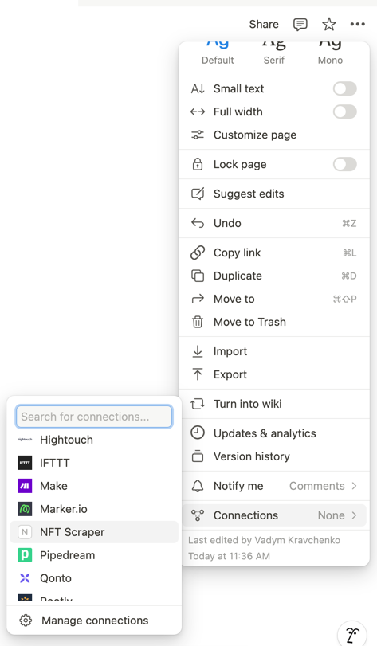
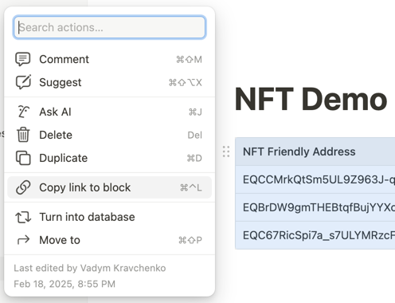

This repository contains a Telegram Mini App built with Next.js that allows authorized users to view a list of NFT items.

### Features and Technology Stack
- Next.js v14 and React v18
- TonConnect for authorization
- Notion Integrations as a main data source
- Ton API to retrieve the data from blockchain
- Tailwind for styling
- Vercel for deployment

You can find the deployed service following this [link](https://ton-nft-marketplace-tau.vercel.app).

## Getting Started

Clone the repository, install dependencies, and copy the `.env.example` contents to `.env`:

```bash
~ git clone git@github.com:krau5/ton-nft-marketplace.git
~ cd ton-nft-marketplace
~ npm i
~ cp .env.example .env
```

### Setting up environment variables

To configure the `.env` file, you need data from Notion and Tonconsole.

#### Notion configuration

1. Open your [Notion Integrations](https://www.notion.so/profile/integrations), create an internal integration, and copy the **Internal Integration Secret** to the `NOTION_TOKEN` field in `.env`.
2. Connect your integration to the Notion page containing the NFT table.
   
3. Copy the link to the table node on your page.
   
4. Extract the table ID from the URL (the part after `#`) and paste it into the `NOTION_NFT_TABLE_ID` field in `.env`.

Example Notion URL:
```
https://www.notion.so/user/demo-page-19ea6efae12345719034d4e310fa4964?pvs=4#19ea6efae5568056a6deec39479f3d25
```
Extracted `NOTION_NFT_TABLE_ID`:
```
19ea6efae5568056a6deec39479f3d25
```

#### TON API Configuration

1. Open [Tonconsole](https://tonconsole.com/tonapi/api-keys) and create an API key.
2. Copy and paste it into the `TON_API_KEY` field in `.env`.

Once environment variables are set up, you can start the application with:
```bash
~ npm run dev
```
The app will be available at `http://localhost:3000/`.

### Scripts

- `npm run dev` - launches the application in development mode
- `npm run build` - builds the application
- `npm start` - runs the production build
- `npm run lint` - checks code quality using ESLint
- `npm run lint:fix` - fixes linting issues if possible
- `npm run check-types` - launches type checking process using TS compiler
